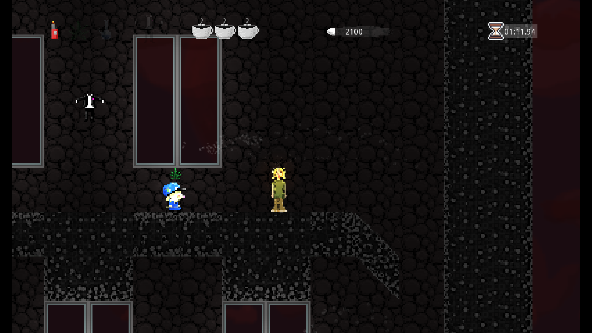

# Potthegreen and The Secrets of the Bong

Welcome to **The Secrets of the Bong**, a hilarious and fast-paced 2D platformer that takes you on a stoner's ultimate adventure. In this pixel-art gem developed using Godot 3, you'll embark on a journey as a lovable pothead, determined to gather smoking items while evading the ever-watchful eyes of the police. Get ready for an uproarious experience that'll keep you hooked!

## Table of Contents

- [Gameplay](#gameplay)
- [Features](#features)
- [Installation](#installation)
- [Controls](#controls)
- [Screenshots](#screenshot)
- [Contributing](#contributing)
- [License](#license)

## Gameplay

In **The Secrets of the Bong**, you play as 'Potthegreen', a chill stoner with a mission. Potthegreen's ultimate goal is to collect all the essential smoking items scattered throughout the levels so he can finally enjoy his smoke. However, it's not as easy as it sounds – the police are hot on his trail, and he must dodge their clutches to succeed.

Navigate through a variety of creatively designed levels, each with its own challenges, obstacles, and surprises. Avoid patrolling police officers, jump over obstacles, and solve puzzles to progress. As you collect smoking items, you'll inch closer to your goal. And remember, the clock is ticking, so keep your wits about you!

## Features

- **Pixel Art Delight:** Immerse yourself in nostalgic pixel art that adds charm and humor to the gameplay.

- **Fast-Paced Action:** Enjoy a thrilling, high-speed platforming experience that keeps you engaged from start to finish.

- **Hilarious Storyline:** Follow Potthegreen's hilarious journey as he tries to gather his smoking essentials without getting caught.

- **Diverse Levels:** Explore a range of creatively designed levels, each with unique challenges and obstacles.

- **Clever Puzzles:** Put on your thinking cap as you encounter brain-teasing puzzles that stand between Potthegreen and his beloved smoking items.

- **Police Evasion:** Stay one step ahead of the vigilant police officers who are determined to foil Potthegreen's plans.

- **Collectibles:** Grab power-ups and special items along the way to enhance Potthegreen's abilities and score more points.

- **Time Pressure:** Feel the adrenaline rush as you race against the clock to collect all the items before time runs out.

## Installation

To play **The Secrets of the Bong**, follow these steps:

1. Clone this repository using the following command:
   ```
   git clone https://github.com/surtarso/secrets-of-the-bong.git
   ```

2. Open Godot 3 and import the project by selecting the project.godot file.

3. Customize the game settings, controls, and graphics as per your preference.

4. Run the game from Godot and embark on Potthegreen's stoner adventure!

## Controls

- **Arrow Left/Right:** Move Potthegreen left or right.
- **Spacebar:** Jump to avoid obstacles or the police.
- **J/Right Mouse:** Blink.
- **L/Left Mouse:** Use powerful smoke blows on enemies.
- **K/Middle Mouse**: Use power-ups.
- **Esc:** Pause the game or access the menu.

## Screenshot


*Watch out for those police officers!*

## Contributing

We welcome contributions to make this game even more enjoyable. If you have suggestions, bug fixes, or new features to propose, feel free to open an issue or submit a pull request. Let's make Potthegreen's adventure truly epic!

## License

This game is released under the [MIT License](LICENSE), which means you're free to modify and distribute the game. However, please give credit to the original creators by linking back to this repository.

---

Get ready to laugh, jump, and dodge your way through an unforgettable stoner adventure in **The Secrets of the Bong**. Download the game, embrace the hilarity, and help Potthegreen achieve his ultimate goal – all while avoiding the clutches of the ever-watchful police!

Compiled builds and screenshots @
[surtarso.itch.io](https://surtarso.itch.io/potthegreen-and-the-secrets-of-the-bong)
##### [Play me on a browser!](https://tarsogalvao.ddns.net/games/bong) (not optmized for browsers.)
